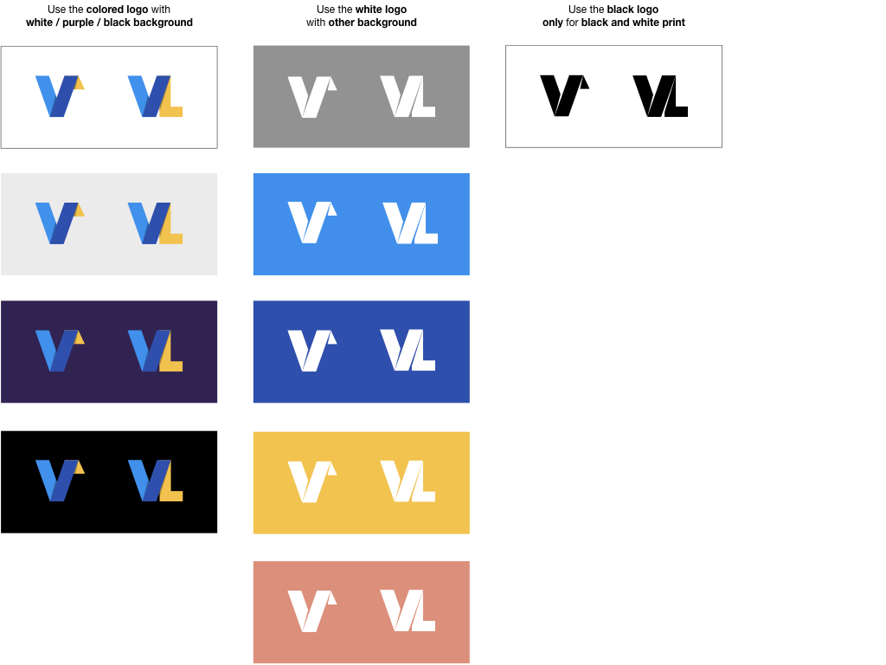

# Logos for the Vega Project

We have versions of these logos as PNG (in various resolutions), SVG, and PDF. The Vega and Vega-Lite logos have monochrome black and white variants.

## Vega Project Logo


## Vega and Vega-Lite Logos

### Vega

- [__Colored Logo__](assets/VG_Color@128.png)


- [__Black Logo__](assets/VG_Black@128.png)


- [__White Logo__](assets/VG_White@128.png)

### Vega-Lite 

- [__Colored Logo__](assets/VL_Color@128.png)


- [__Black Logo__](assets/VL_Black@128.png)


- [__Black Logo__](assets/VL_White@128.png)

## Guidelines for Vega and Vega-Lite Logos



## Favicon

The Vega Project favicon is at https://github.com/vega/vega.github.io/blob/master/favicon.ico.

```html
<link rel="shortcut icon" href="https://vega.github.io/favicon.ico" />
```
